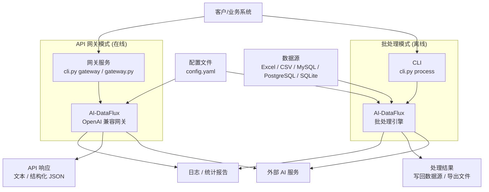
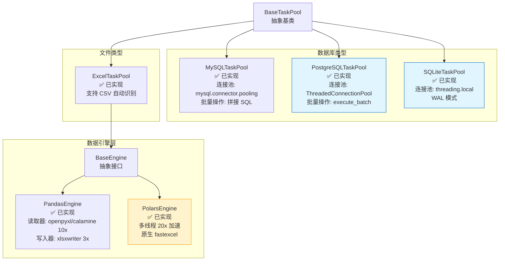

# AI-DataFlux 系统架构文档

本文档全面阐述 AI-DataFlux 的系统架构、设计决策、核心机制和技术实现。

---

## 目录

- [1. 系统概览](#1-系统概览)
  - [1.1 系统定位](#11-系统定位)
  - [1.2 设计哲学](#12-设计哲学)
  - [1.3 架构视图](#13-架构视图)
  - [1.4 系统依赖关系图](#14-系统依赖关系图)
  - [1.5 使用场景](#15-使用场景)
- [2. 项目结构](#2-项目结构)
  - [2.1 目录布局](#21-目录布局)
  - [2.2 关键文件说明](#22-关键文件说明)
  - [2.3 文件组织原则](#23-文件组织原则)
- [3. 架构分层](#3-架构分层)
  - [3.1 分层概述](#31-分层概述)
  - [3.2 层间交互](#32-层间交互)
- [4. 双组件架构](#4-双组件架构)
  - [4.1 架构设计](#41-架构设计)
  - [4.2 组件优势](#42-组件优势)
- [5. 数据源层架构](#5-数据源层架构)
  - [5.1 抽象设计](#51-抽象设计)
  - [5.2 数据源实现](#52-数据源实现)
  - [5.3 引擎层抽象](#53-引擎层抽象)
  - [5.4 工厂模式](#54-工厂模式)
- [6. 核心处理引擎](#6-核心处理引擎)
  - [6.1 UniversalAIProcessor（协调者）](#61-universalaiprocessor协调者)
  - [6.2 组件化架构](#62-组件化架构)
  - [6.3 连续任务流模式](#63-连续任务流模式)
- [7. API 网关架构](#7-api-网关架构)
  - [7.1 组件概览](#71-组件概览)
  - [7.2 模型选择算法](#72-模型选择算法)
  - [7.3 故障转移机制](#73-故障转移机制)
  - [7.4 令牌桶限流](#74-令牌桶限流)
  - [7.5 FastAPI 路由](#75-fastapi-路由)
- [8. 数据流与生命周期](#8-数据流与生命周期)
  - [8.1 完整数据流](#81-完整数据流)
  - [8.2 内存生命周期](#82-内存生命周期)
- [9. 核心设计决策](#9-核心设计决策)
  - [9.1 组件化设计](#91-组件化设计)
  - [9.2 元数据分离](#92-元数据分离)
  - [9.3 连续任务流 vs 批处理](#93-连续任务流-vs-批处理)
  - [9.4 API 熔断 vs 指数退避](#94-api-熔断-vs-指数退避)
  - [9.5 向量化 vs 逐行遍历](#95-向量化-vs-逐行遍历)
- [10. 并发与性能](#10-并发与性能)
  - [10.1 异步并发模型](#101-异步并发模型)
  - [10.2 内存管理](#102-内存管理)
  - [10.3 性能优化技术](#103-性能优化技术)
- [11. 错误处理体系](#11-错误处理体系)
  - [11.1 错误分类](#111-错误分类)
  - [11.2 分类重试策略](#112-分类重试策略)
  - [11.3 熔断机制](#113-熔断机制)
  - [11.4 错误记录](#114-错误记录)
- [12. 扩展性设计](#12-扩展性设计)
  - [12.1 添加新数据源](#121-添加新数据源)
  - [12.2 添加新引擎](#122-添加新引擎)
  - [12.3 添加新组件](#123-添加新组件)
- [13. 技术栈](#13-技术栈)
  - [13.1 核心依赖](#131-核心依赖)
  - [13.2 数据源依赖](#132-数据源依赖)
  - [13.3 性能优化依赖](#133-性能优化依赖)
  - [13.4 可选依赖](#134-可选依赖)
  - [13.5 架构模式](#135-架构模式)

---

## 1. 系统概览

### 1.1 系统定位

AI-DataFlux 是一个**高性能、可扩展的 AI 批处理引擎**，专为处理大规模数据集与 AI 模型交互而设计。

**核心特性**：
- ✅ 支持 5 种数据源（Excel/CSV/MySQL/PostgreSQL/SQLite）
- ✅ 双引擎支持（Pandas/Polars），100万+ 行数据优化
- ✅ 连续任务流模式，恒定并发度
- ✅ 分类重试策略 + API 熔断机制
- ✅ 加权负载均衡 + 自动故障转移
- ✅ OpenAI 兼容 API 网关

### 1.2 设计哲学

| 原则 | 体现 |
|------|------|
| **高内聚低耦合** | 组件化设计（Content, State, Retry, Clients），职责单一 |
| **配置驱动** | 所有行为通过配置文件控制，无需修改代码 |
| **策略模式** | 可插拔数据引擎、可配置重试策略 |
| **异步优先** | 全链路异步（aiohttp + asyncio），高吞吐量 |
| **内存安全** | 元数据分离、动态分片、自动 GC |
| **可观测性** | 完整日志、进度追踪、性能指标 |

### 1.3 架构视图

```
┌─────────────────────────────────────────────────────────────────┐
│                        AI-DataFlux                              │
├─────────────────────────────────────────────────────────────────┤
│                                                                 │
│  ┌──────────────┐      ┌──────────────┐      ┌──────────────┐ │
│  │  CLI Layer   │      │ Config Layer │      │  Log System  │ │
│  │  (cli.py)    │─────▶│ (settings)   │◀─────│  (logging)   │ │
│  └──────┬───────┘      └──────────────┘      └──────────────┘ │
│         │                                                       │
│         ▼                                                       │
│  ┌─────────────────────────────────────────────────────────┐   │
│  │           Data Processing Engine                        │   │
│  │         (UniversalAIProcessor + Components)             │   │
│  │                                                           │   │
│  │  ┌─────────────┐  ┌─────────────┐  ┌─────────────┐     │   │
│  │  │  Content    │  │   State     │  │   Retry     │     │   │
│  │  │  Processor  │  │   Manager   │  │  Strategy   │     │   │
│  │  └─────────────┘  └─────────────┘  └─────────────┘     │   │
│  │                                                           │   │
│  │  ┌─────────────┐  ┌─────────────┐  ┌─────────────┐     │   │
│  │  │  Flux AI    │  │  Sharded    │  │    JSON     │     │   │
│  │  │   Client    │  │   Task Mgr  │  │  Validator  │     │   │
│  │  └─────────────┘  └─────────────┘  └─────────────┘     │   │
│  └───────────────────────┬─────────────────────────────────┘   │
│                          │                                     │
│                          ▼                                     │
│  ┌─────────────────────────────────────────────────────────┐   │
│  │              Data Source Layer                          │   │
│  │           (BaseTaskPool + Implementations)              │   │
│  │                                                           │   │
│  │  ┌──────────┐  ┌──────────┐  ┌──────────┐  ┌─────────┐ │   │
│  │  │  MySQL   │  │ Postgres │  │  SQLite  │  │  Excel  │ │   │
│  │  │ TaskPool │  │ TaskPool │  │ TaskPool │  │TaskPool │ │   │
│  │  └──────────┘  └──────────┘  └──────────┘  └────┬────┘ │   │
│  │                                                   │      │   │
│  │                                     ┌─────────────▼────┐ │   │
│  │                                     │  BaseEngine      │ │   │
│  │                                     │  (Pandas/Polars) │ │   │
│  │                                     └──────────────────┘ │   │
│  └─────────────────────────────────────────────────────────┘   │
│                          │                                     │
│                          ▼                                     │
│  ┌─────────────────────────────────────────────────────────┐   │
│  │               API Gateway Layer                         │   │
│  │             (FastAPI + Components)                      │   │
│  │                                                           │   │
│  │  ┌─────────────┐  ┌─────────────┐  ┌─────────────┐     │   │
│  │  │   Model     │  │   Token     │  │   Session   │     │   │
│  │  │ Dispatcher  │  │   Bucket    │  │    Pool     │     │   │
│  │  └─────────────┘  └─────────────┘  └─────────────┘     │   │
│  └───────────────────────┬─────────────────────────────────┘   │
│                          │                                     │
│                          ▼                                     │
│                  ┌──────────────┐                              │
│                  │  AI Models   │                              │
│                  │ (External)   │                              │
│                  └──────────────┘                              │
└─────────────────────────────────────────────────────────────────┘
```

### 1.4 系统依赖关系图

从内部模块依赖的角度看，AI-DataFlux 的组件关系如下：

```mermaid
flowchart TB
  User[用户/客户端]

  subgraph Entry["入口层"]
    CLI[cli.py]
    Main[main.py]
    Gateway[gateway.py]
  end

  subgraph Config["配置层"]
    ConfigFile[config.yaml]
    Settings[config/settings.py]
  end

  subgraph Models["模型层"]
    Errors[models/errors.py]
    TaskMeta[models/task.py]
  end

  subgraph Core["核心处理层 (组件化)"]
    Processor[core/processor.py<br/>(协调者)]
    Scheduler[core/scheduler.py]
    Validator[core/validator.py]
    TokenEst[core/token_estimator.py]

    subgraph Components["功能组件"]
        Clients[core/clients/*<br/>API通信]
        Content[core/content/*<br/>Prompt/解析]
        State[core/state/*<br/>状态管理]
        Retry[core/retry/*<br/>重试策略]
    end
  end

  subgraph Data["数据源层"]
    Factory[data/factory.py]
    BasePool[data/base.py]
    Excel[data/excel.py<br/>(含 CSV)]
    MySQL[data/mysql.py]
    PostgreSQL[data/postgresql.py]
    SQLite[data/sqlite.py]
    Engines[data/engines/*]
  end

  subgraph GatewayLayer["API 网关层"]
    App[gateway/app.py]
    Service[gateway/service.py]
    Dispatcher[gateway/dispatcher.py]
    Limiter[gateway/limiter.py]
    Session[gateway/session.py]
    Resolver[gateway/resolver.py]
    Schemas[gateway/schemas.py]
  end

  subgraph External["外部 AI API"]
    OpenAI[OpenAI 兼容 API]
    Claude[Claude API]
    Other[其他兼容 API]
  end

  %% 入口依赖
  User --> CLI
  User --> Gateway
  CLI --> Main
  CLI --> Gateway

  %% 配置依赖
  ConfigFile --> Settings
  Settings --> Main
  Settings --> Gateway
  Settings --> Processor

  %% 核心流程
  Main --> Processor

  %% Processor 协调组件
  Processor --> Scheduler
  Processor --> Validator
  Processor --> Factory
  Processor --> TokenEst
  Processor --> Clients
  Processor --> Content
  Processor --> State
  Processor --> Retry

  %% 数据源工厂
  Factory --> BasePool
  Factory --> Excel
  Factory --> MySQL
  Factory --> PostgreSQL
  Factory --> SQLite
  Factory --> Engines

  %% 模型使用
  Errors --> Processor
  Errors --> Retry
  TaskMeta --> State
  TaskMeta --> Scheduler
  Errors --> Service
  Schemas --> Service

  %% 网关内部流程
  Gateway --> App
  App --> Service
  Service --> Dispatcher
  Service --> Limiter
  Service --> Session
  Service --> Resolver

  %% 外部调用
  Dispatcher --> External
  Clients --> External
```

### 1.5 使用场景

从用户使用的角度看，AI-DataFlux 支持两种运行模式：



**使用场景说明**：

**批处理模式** (离线数据处理):
- 适用场景：大批量数据的 AI 处理任务（Excel/CSV/数据库中的历史数据）
- 数据流向：数据源 → 批处理引擎 → AI API → 结果写回数据源
- 特点：高吞吐量、自动重试、进度追踪、结果持久化

**API 网关模式** (在线服务):
- 适用场景：实时 AI 请求转发、多模型负载均衡、统一 API 接口
- 数据流向：客户端 → API 网关 → AI API → 即时响应
- 特点：OpenAI 兼容、加权随机调度、令牌桶限流、自动故障转移

---

## 2. 项目结构

### 2.1 目录布局

```
AI-DataFlux/
├── main.py              # 数据处理入口
├── gateway.py           # API 网关入口
├── cli.py               # 统一命令行入口
├── config.yaml          # 用户配置文件
├── config-example.yaml  # 配置示例
├── requirements.txt     # Python 依赖
├── pyproject.toml       # 项目元数据 (可选)
├── README.md            # 项目说明
├── docs/
│   ├── ARCH.md             # 本架构文档
│   ├── CONFIG.md           # 配置参数详解
│   └── CLAUDE.md           # Claude Code 开发指南
├── src/
│   ├── __init__.py      # 包初始化
│   ├── config/          # 配置管理模块
│   │   ├── __init__.py
│   │   └── settings.py  # 配置加载、深度合并、日志初始化
│   ├── models/          # 数据模型定义
│   │   ├── __init__.py
│   │   ├── errors.py    # ErrorType 枚举、异常类
│   │   └── task.py      # TaskMetadata 数据类
│   ├── core/            # 核心处理逻辑 (组件化架构)
│   │   ├── __init__.py
│   │   ├── clients/     # AI API 客户端层
│   │   │   ├── __init__.py
│   │   │   ├── base.py        # BaseAIClient 抽象
│   │   │   └── flux_client.py # FluxAIClient 实现
│   │   ├── content/     # 内容处理层
│   │   │   ├── __init__.py
│   │   │   └── processor.py   # ContentProcessor (Prompt + 解析)
│   │   ├── retry/       # 重试策略层
│   │   │   ├── __init__.py
│   │   │   └── strategy.py    # RetryStrategy (决策引擎)
│   │   ├── state/       # 状态管理层
│   │   │   ├── __init__.py
│   │   │   └── manager.py     # TaskStateManager (并发控制)
│   │   ├── processor.py # 核心协调器 (UniversalAIProcessor)
│   │   ├── scheduler.py # 分片任务调度器 (ShardedTaskManager)
│   │   ├── validator.py # JSON 字段验证器 (JsonValidator)
│   │   └── token_estimator.py # Token 估算器 (TokenEstimator)
│   ├── data/            # 数据源层
│   │   ├── __init__.py
│   │   ├── base.py      # BaseTaskPool 抽象基类
│   │   ├── excel.py     # ExcelTaskPool (含 CSV 自动识别)
│   │   ├── mysql.py     # MySQLTaskPool (mysql-connector)
│   │   ├── postgresql.py # PostgreSQLTaskPool (psycopg2)
│   │   ├── sqlite.py    # SQLiteTaskPool (sqlite3)
│   │   ├── factory.py   # 任务池工厂 (create_task_pool)
│   │   └── engines/     # 可插拔数据引擎
│   │       ├── __init__.py
│   │       ├── base.py        # BaseEngine 抽象接口
│   │       ├── pandas_engine.py # PandasEngine 实现
│   │       └── polars_engine.py # PolarsEngine 实现
│   └── gateway/         # API 网关
│       ├── __init__.py
│       ├── app.py       # FastAPI 应用 (端点定义)
│       ├── service.py   # FluxApiService (核心服务)
│       ├── dispatcher.py # ModelDispatcher (加权随机选择)
│       ├── limiter.py   # TokenBucket (令牌桶限流)
│       ├── session.py   # SessionPool (连接池管理)
│       ├── resolver.py  # RoundRobinResolver (IP 轮询)
│       └── schemas.py   # Pydantic 数据模型
└── tests/               # 测试套件
    ├── conftest.py      # pytest 共享 fixtures
    ├── core/
    │   ├── test_clients.py
    │   ├── test_content.py
    │   ├── test_state.py
    │   └── test_retry.py
    ├── test_sqlite_pool.py
    ├── test_postgresql_pool.py
    ├── test_csv_pool.py
    ├── test_engines.py
    └── test_integration.py
```

### 2.2 关键文件说明

| 文件路径 | 职责 | 关键类/函数 |
|---------|------|-----------|
| **入口层** |
| `cli.py` | 统一命令行工具 | `cmd_process()`, `cmd_gateway()`, `cmd_check()`, `cmd_token()` |
| `main.py` | 批处理模式入口 | `main()` |
| `gateway.py` | 网关模式入口 | `main()` |
| **配置层** |
| `src/config/settings.py` | 配置管理 | `load_config()`, `merge_config()`, `init_logging()` |
| **模型层** |
| `src/models/errors.py` | 错误分类 | `ErrorType(Enum)`, `classify_error()` |
| `src/models/task.py` | 任务元数据 | `TaskMetadata`, `ErrorRecord` |
| **核心处理层** |
| `src/core/processor.py` | 协调者 | `UniversalAIProcessor` |
| `src/core/scheduler.py` | 分片调度 | `ShardedTaskManager` |
| `src/core/validator.py` | 字段验证 | `JsonValidator` |
| `src/core/token_estimator.py` | Token 估算 | `TokenEstimator` |
| `src/core/clients/flux_client.py` | AI API 通信 | `FluxAIClient` |
| `src/core/content/processor.py` | 内容处理 | `ContentProcessor` |
| `src/core/state/manager.py` | 状态管理 | `TaskStateManager` |
| `src/core/retry/strategy.py` | 重试策略 | `RetryStrategy`, `RetryAction`, `RetryDecision` |
| **数据源层** |
| `src/data/factory.py` | 工厂方法 | `create_task_pool()` |
| `src/data/base.py` | 抽象基类 | `BaseTaskPool(ABC)` |
| `src/data/excel.py` | Excel/CSV 实现 | `ExcelTaskPool` |
| `src/data/mysql.py` | MySQL 实现 | `MySQLTaskPool`, `MySQLConnectionPoolManager` |
| `src/data/postgresql.py` | PostgreSQL 实现 | `PostgreSQLTaskPool` |
| `src/data/sqlite.py` | SQLite 实现 | `SQLiteTaskPool` |
| `src/data/engines/base.py` | 引擎抽象 | `BaseEngine(ABC)` |
| `src/data/engines/pandas_engine.py` | Pandas 引擎 | `PandasEngine` |
| `src/data/engines/polars_engine.py` | Polars 引擎 | `PolarsEngine` |
| **网关层** |
| `src/gateway/app.py` | FastAPI 应用 | `app`, `/v1/chat/completions` |
| `src/gateway/service.py` | 核心服务 | `FluxApiService` |
| `src/gateway/dispatcher.py` | 模型调度 | `ModelDispatcher` |
| `src/gateway/limiter.py` | 限流器 | `TokenBucket`, `ModelRateLimiter` |
| `src/gateway/session.py` | 连接池 | `SessionPool` |
| `src/gateway/resolver.py` | DNS 解析 | `RoundRobinResolver` |

### 2.3 文件组织原则

1. **单一职责**：每个文件/类只负责一个明确的功能
2. **分层清晰**：严格按照 配置 → 处理 → 数据 → 网关 的层次组织
3. **易于测试**：核心逻辑组件化，便于单元测试
4. **可扩展性**：通过抽象基类和工厂模式支持新数据源/引擎

---

## 3. 架构分层

### 2.1 分层概述

AI-DataFlux 采用**经典的四层架构**，从上到下依次为：

```
┌─────────────────────────────────────────┐
│  1. 接入层 (Access Layer)               │
│     - CLI 入口                          │
│     - 配置管理                          │
│     - 日志系统                          │
└─────────────┬───────────────────────────┘
              │
              ▼
┌─────────────────────────────────────────┐
│  2. 处理层 (Processing Layer)           │
│     - UniversalAIProcessor (协调者)     │
│     - 组件编排（Content/State/Retry）   │
│     - 分片调度                          │
└─────────────┬───────────────────────────┘
              │
              ▼
┌─────────────────────────────────────────┐
│  3. 数据层 (Data Layer)                 │
│     - BaseTaskPool (抽象)               │
│     - 5 种数据源实现                    │
│     - BaseEngine (DataFrame 抽象)       │
└─────────────┬───────────────────────────┘
              │
              ▼
┌─────────────────────────────────────────┐
│  4. 网关层 (Gateway Layer)              │
│     - FluxApiService                    │
│     - 模型调度 + 限流                   │
│     - 连接池管理                        │
└─────────────┬───────────────────────────┘
              │
              ▼
         External AI APIs
```

### 3.2 层间交互

| 层级 | 职责 | 依赖方向 | 关键接口 |
|------|------|---------|---------|
| **接入层** | 命令行解析、配置加载、日志初始化 | → 处理层 | `load_config()`, `init_logging()` |
| **处理层** | 任务编排、流程控制、组件协调 | → 数据层 + 网关层 | `run()`, `process_shard_async_continuous()` |
| **数据层** | 数据读写、分片管理、任务队列 | → 基础设施 | `BaseTaskPool` 抽象方法 |
| **网关层** | 模型路由、负载均衡、限流熔断 | → 外部 API | `/v1/chat/completions` |

**依赖原则**：
- ✅ 上层依赖下层（单向依赖）
- ✅ 下层不依赖上层
- ✅ 同层组件通过接口交互

---

## 4. 双组件架构

### 4.1 架构设计

AI-DataFlux 采用**解耦的双组件架构**：

```
┌────────────────────────────────────────────────────┐
│  Component 1: Data Processing Engine               │
│  (main.py / cli.py process)                        │
│                                                    │
│  职责:                                              │
│  • 数据源读写                                       │
│  • 任务分片与调度                                   │
│  • Prompt 生成                                     │
│  • 响应解析与验证                                   │
│  • 重试决策                                        │
│  • 结果写回                                        │
│                                                    │
│  技术栈: asyncio + aiohttp                         │
└─────────────────┬──────────────────────────────────┘
                  │ HTTP/JSON
                  │ (OpenAI Compatible)
                  ▼
┌────────────────────────────────────────────────────┐
│  Component 2: API Gateway                          │
│  (gateway.py / cli.py gateway)                     │
│                                                    │
│  职责:                                              │
│  • 多模型管理                                       │
│  • 加权随机选择                                     │
│  • 自动故障转移                                     │
│  • 令牌桶限流                                       │
│  • 连接池管理                                       │
│  • 流式/非流式响应                                  │
│                                                    │
│  技术栈: FastAPI + aiohttp                         │
└─────────────────┬──────────────────────────────────┘
                  │ HTTP/JSON
                  │ (OpenAI API)
                  ▼
           ┌──────────────┐
           │  AI Models   │
           │  (External)  │
           └──────────────┘
```

### 4.2 组件优势

**解耦优势**：
1. **独立部署**：可分别部署在不同服务器
2. **独立扩展**：Gateway 可水平扩展（多实例）
3. **故障隔离**：一个组件失败不影响另一个
4. **灵活替换**：Gateway 可被其他 OpenAI 兼容服务替换

**通信协议**：
- 协议：HTTP/1.1
- 格式：JSON
- 兼容：OpenAI Chat Completions API

---

## 5. 数据源层架构

### 5.1 抽象设计

数据源层采用**抽象基类 + 工厂模式**：

```python
BaseTaskPool (ABC)
    │
    ├── 必须实现的抽象方法:
    │   ├── get_total_task_count() → int
    │   ├── get_processed_task_count() → int
    │   ├── get_id_boundaries() → (min_id, max_id)
    │   ├── initialize_shard(shard_id, min_id, max_id) → count
    │   ├── get_task_batch(batch_size) → [(id, data), ...]
    │   ├── update_task_results(results_dict) → None
    │   ├── reload_task_data(task_id) → dict | None
    │   └── close() → None
    │
    └── 已实现的通用方法:
        ├── add_task_to_front(task_id, data)
        ├── add_task_to_back(task_id, data)
        ├── has_tasks() → bool
        ├── get_remaining_count() → int
        └── clear_tasks()
```

### 5.2 数据源实现

**继承关系与特性**：



**详细特性**：

```
BaseTaskPool
    │
    ├─── MySQLTaskPool
    │    ├─ 连接池: mysql.connector.pooling (单例模式)
    │    ├─ 批量操作: 拼接 SQL
    │    └─ 特点: 跨平台、社区驱动
    │
    ├─── PostgreSQLTaskPool
    │    ├─ 连接池: psycopg2.pool.ThreadedConnectionPool
    │    ├─ 批量操作: psycopg2.extras.execute_batch
    │    └─ 特点: 企业级、事务安全
    │
    ├─── SQLiteTaskPool
    │    ├─ 连接池: threading.local (线程隔离)
    │    ├─ WAL 模式: 自动启用
    │    └─ 特点: 无服务器、零配置
    │
    └─── ExcelTaskPool (含 CSV)
         ├─ 引擎抽象: BaseEngine
         │  ├─ PandasEngine
         │  │  ├─ 读取器: openpyxl / calamine (10x)
         │  │  └─ 写入器: openpyxl / xlsxwriter (3x)
         │  └─ PolarsEngine
         │     ├─ 读取器: fastexcel (原生)
         │     └─ 写入器: xlsxwriter (原生)
         ├─ 向量化过滤: filter_indices_vectorized (50-100x)
         └─ 自动保存: 定时 flush (save_interval)
```

### 5.3 引擎层抽象

**BaseEngine 接口**：

```python
BaseEngine (ABC)
    │
    ├── 文件读写:
    │   ├── read_excel(path, **kwargs) → DataFrame
    │   ├── write_excel(df, path, **kwargs)
    │   ├── read_csv(path, **kwargs) → DataFrame
    │   └── write_csv(df, path, **kwargs)
    │
    ├── 基础操作:
    │   ├── row_count(df) → int
    │   ├── get_column_names(df) → List[str]
    │   ├── get_value(df, row_idx, col_name) → Any
    │   └── set_value(df, row_idx, col_name, value)
    │
    ├── 高性能操作:
    │   ├── filter_indices_vectorized(...) → List[int]
    │   ├── set_values_batch(df, updates) → DataFrame
    │   ├── is_empty_vectorized(series) → BoolArray
    │   └── slice_by_index_range(df, start, end) → DataFrame
    │
    └── 列管理:
        ├── ensure_columns_exist(df, columns)
        └── add_columns_if_missing(df, columns)
```

**引擎选择逻辑**：

```
配置: datasource.engine = ?
    │
    ├─ "auto" ─────┐
    │              ▼
    │         Polars 可用?
    │              │
    │         ┌────┴────┐
    │        YES       NO
    │         │         │
    │         ▼         ▼
    │    PolarsEngine PandasEngine
    │
    ├─ "pandas" ───▶ PandasEngine
    │
    └─ "polars" ───▶ PolarsEngine (如不可用则报错)
```

### 5.4 工厂模式

**位置**：`src/data/factory.py`

**流程**：

```python
def create_task_pool(config, columns_to_extract, columns_to_write):
    datasource_type = config['datasource']['type']

    # 路由到具体工厂方法
    if datasource_type == "mysql":
        return _create_mysql_pool(...)
    elif datasource_type == "postgresql":
        return _create_postgresql_pool(...)
    elif datasource_type == "sqlite":
        return _create_sqlite_pool(...)
    elif datasource_type == "excel":
        return _create_excel_pool(...)
    elif datasource_type == "csv":
        return _create_csv_pool(...)
    else:
        raise ValueError(f"不支持的数据源类型: {datasource_type}")
```

**优势**：
- ✅ 配置驱动，无需修改核心代码
- ✅ 统一接口，上层无感知
- ✅ 易于扩展新数据源

---

## 6. 核心处理引擎

### 6.1 UniversalAIProcessor（协调者）

**设计模式**：Coordinator Pattern（协调者模式）

**职责**：
- ❌ **不直接执行**具体业务逻辑
- ✅ **编排组件**完成数据流转
- ✅ **控制流程**（初始化 → 循环 → 清理）

**核心流程**：

```python
class UniversalAIProcessor:
    def __init__(self, config):
        # 1. 组件初始化
        self.client = FluxAIClient(...)
        self.content_processor = ContentProcessor(...)
        self.task_state_manager = TaskStateManager()
        self.retry_strategy = RetryStrategy(...)
        self.task_manager = ShardedTaskManager(...)
        self.validator = JsonValidator(...)
        self.task_pool = create_task_pool(...)  # 工厂创建

    async def run(self):
        # 2. 初始化分片
        await self.task_manager.initialize(self.task_pool)

        # 3. 创建异步会话
        async with aiohttp.ClientSession(connector=...) as session:
            # 4. 处理循环
            await self._process_loop(session)

    async def _process_loop(self, session):
        while self.task_manager.has_more_shards():
            # 5. 加载下一分片
            await self.task_manager.load_next_shard()

            # 6. 连续任务流处理
            await self.process_shard_async_continuous(session)
```

### 6.2 组件化架构

```
UniversalAIProcessor (协调者)
    │
    ├── FluxAIClient
    │   └─ 职责: API 通信、超时管理、错误封装
    │
    ├── ContentProcessor
    │   ├─ create_prompt(data) → messages
    │   ├─ parse_response(content) → dict
    │   └─ build_schema() → JSON Schema
    │
    ├── TaskStateManager
    │   ├─ try_start_task(id) → bool
    │   ├─ complete_task(id)
    │   ├─ get_metadata(id) → TaskMetadata
    │   └─ cleanup_expired(hours=24)
    │
    ├── RetryStrategy
    │   ├─ decide(error_type, metadata) → RetryDecision
    │   ├─ 熔断管理: last_pause_end_time
    │   └─ 时间窗口: api_error_trigger_window
    │
    ├── ShardedTaskManager
    │   ├─ calculate_optimal_shard_size(total_range) → int
    │   ├─ initialize(task_pool)
    │   ├─ load_next_shard()
    │   ├─ monitor_memory_usage()
    │   └─ 进度追踪: total_processed, success_rate
    │
    └── JsonValidator
        ├─ configure(validation_config)
        └─ validate(data) → (is_valid, errors)
```

### 6.3 连续任务流模式

**核心方法**：`process_shard_async_continuous()`

**算法**：

```python
async def process_shard_async_continuous(self, session):
    active_tasks = set()  # 活跃的 asyncio.Task 集合
    results_buffer = {}   # 结果缓冲区

    while True:
        # 1. 动态填充任务池
        space_available = batch_size - len(active_tasks)
        if space_available > 0:
            new_tasks = task_pool.get_task_batch(space_available)
            for task_id, data in new_tasks:
                task = asyncio.create_task(
                    self._process_single_task(session, task_id, data)
                )
                active_tasks.add(task)

        # 2. 等待任意任务完成
        if not active_tasks:
            break

        done, pending = await asyncio.wait(
            active_tasks,
            return_when=asyncio.FIRST_COMPLETED
        )

        # 3. 处理完成任务
        for task in done:
            result = await task
            if result.success:
                results_buffer[result.task_id] = result.data
            else:
                # 重试决策
                decision = retry_strategy.decide(...)
                if decision.action == RETRY:
                    task_pool.add_task_to_front(...)
                elif decision.action == PAUSE_THEN_RETRY:
                    await asyncio.sleep(decision.pause_duration)
                    task_pool.add_task_to_front(...)

            active_tasks.discard(task)

        # 4. 批量写回
        if len(results_buffer) >= batch_size:
            task_pool.update_task_results(results_buffer)
            results_buffer.clear()
```

**优势**：
- ✅ 恒定并发度（始终保持 `batch_size` 个任务在飞）
- ✅ 实时处理（无需等待整批完成）
- ✅ 内存友好（流式处理，结果即时写回）
- ✅ 灵活重试（失败任务立即放回队列）

**对比传统批处理**：

| 维度 | 批处理模式 | 连续任务流模式 |
|------|-----------|---------------|
| 并发度 | 波动（失败任务导致下降） | 恒定（动态补充） |
| 延迟 | 高（等待最慢任务） | 低（实时处理） |
| 内存 | 高（批次结果堆积） | 低（流式写回） |
| 重试 | 下一批次 | 立即重试 |

---

## 7. API 网关架构

### 7.1 组件概览

```
FluxApiService (核心服务)
    │
    ├── ModelDispatcher (模型调度器)
    │   ├─ 加权随机选择: random.choices(weights=...)
    │   ├─ 故障标记: mark_model_failed()
    │   ├─ 指数退避: 2s → 4s → 6s → exponential (max 60s)
    │   └─ 可用性检查: is_available()
    │
    ├── ModelRateLimiter (限流器)
    │   ├─ 令牌桶: TokenBucket (capacity = safe_rps * 2)
    │   ├─ 读写锁: RWLock (读多写少)
    │   ├─ can_process(model_id) → bool
    │   └─ acquire(model_id) → bool
    │
    ├── SessionPool (连接池管理)
    │   ├─ 分组键: (ssl_verify, proxy)
    │   ├─ 连接复用: aiohttp.ClientSession
    │   ├─ TCPConnector 配置:
    │   │  ├─ limit: max_connections
    │   │  ├─ limit_per_host: max_connections_per_host
    │   │  └─ resolver: RoundRobinResolver (可选)
    │   └─ DNS 缓存: 无 resolver 时 TTL=10s
    │
    └── RoundRobinResolver (DNS 解析器)
        ├─ IP 池轮询: ip_pool = ['1.2.3.4', '1.2.3.5', ...]
        ├─ 线程安全: threading.Lock
        └─ 轮询算法: index = (index + 1) % len(ip_pool)
```

### 7.2 模型选择算法

**加权随机选择**：

```python
def get_available_model(excluded_models: set) -> Model:
    # 1. 过滤可用模型
    available = [
        m for m in models
        if m.weight > 0
        and m not in excluded_models
        and dispatcher.is_available(m)  # 未在退避中
        and rate_limiter.can_process(m)  # 未被限流
    ]

    if not available:
        raise RuntimeError("无可用模型")

    # 2. 加权随机选择
    weights = [m.weight for m in available]
    chosen = random.choices(available, weights=weights, k=1)[0]

    return chosen
```

**概率分布**：
- `weight=10` → 被选概率 = 10 / (10+5+3) = 55.6%
- `weight=5` → 被选概率 = 5 / 18 = 27.8%
- `weight=3` → 被选概率 = 3 / 18 = 16.7%

### 7.3 故障转移机制

```python
async def chat_completion(request):
    excluded_models = set()

    for attempt in range(3):  # 最多尝试 3 个不同模型
        try:
            # 1. 选择模型
            model = get_available_model(excluded_models)

            # 2. 检查限流
            if not rate_limiter.acquire(model.id):
                excluded_models.add(model)
                continue

            # 3. 调用 API
            result = await _call_model_api(model, request)

            # 4. 成功 → 更新指标
            dispatcher.mark_model_success(model)
            return result

        except Exception as e:
            # 5. 失败 → 标记并排除
            dispatcher.mark_model_failed(model)
            excluded_models.add(model)
            logging.warning(f"模型 {model.name} 调用失败: {e}")

    raise RuntimeError("所有模型均不可用")
```

### 7.4 令牌桶限流

**算法**：

```python
class TokenBucket:
    def __init__(self, capacity: int, rate: float):
        self.capacity = capacity  # 桶容量
        self.tokens = capacity    # 当前令牌数
        self.rate = rate          # 令牌生成速率（个/秒）
        self.last_update = time.time()

    def acquire(self) -> bool:
        # 1. 补充令牌
        now = time.time()
        elapsed = now - self.last_update
        self.tokens = min(
            self.capacity,
            self.tokens + elapsed * self.rate
        )
        self.last_update = now

        # 2. 消耗令牌
        if self.tokens >= 1.0:
            self.tokens -= 1.0
            return True
        else:
            return False
```

**配置示例**：
```yaml
models:
  - safe_rps: 5  # 每秒 5 个请求
```

**实际行为**：
- 容量：10 个令牌（safe_rps * 2）
- 速率：5 个/秒
- 突发：支持 10 个瞬时请求，然后限速到 5 req/s

### 7.5 FastAPI 路由

```python
# 主要端点
POST /v1/chat/completions      # OpenAI 兼容聊天补全
  - 支持流式 (stream=true)
  - 支持 JSON Schema (response_format)
  - 返回: ChatCompletionResponse | StreamingResponse

GET /v1/models                 # 可用模型列表（OpenAI 兼容）
  - 返回: ModelsResponse

# 管理端点
GET /admin/models              # 模型详细状态
  - 返回: 调度指标、限流状态、退避信息

GET /admin/health              # 健康检查
  - 返回: 系统状态、可用模型数

GET /                          # 根路径
  - 返回: 版本信息
```

---

## 8. 数据流与生命周期

### 8.1 完整数据流

```
┌─────────────────────────────────────────────────────────────┐
│  阶段 1: 初始化 (Initialization)                             │
└─────────────────────────────────────────────────────────────┘

1.1 配置加载
    config.yaml
        │
        ▼
    load_config() ──▶ 深度合并 DEFAULT_CONFIG
        │
        ▼
    init_logging() ──▶ 初始化日志系统

1.2 组件创建
    config (dict)
        │
        ├─▶ create_task_pool() ──▶ TaskPool 实例
        │       │
        │       └── 工厂路由:
        │           ├─ mysql → MySQLTaskPool
        │           ├─ postgresql → PostgreSQLTaskPool
        │           ├─ sqlite → SQLiteTaskPool
        │           ├─ excel → ExcelTaskPool(PandasEngine/PolarsEngine)
        │           └─ csv → ExcelTaskPool (CSV 模式)
        │
        └─▶ UniversalAIProcessor(config)
                │
                └── 初始化组件:
                    ├─ FluxAIClient
                    ├─ ContentProcessor
                    ├─ TaskStateManager
                    ├─ RetryStrategy
                    ├─ ShardedTaskManager
                    └─ JsonValidator

1.3 分片计算
    task_pool.get_total_task_count() ──▶ 未处理任务总数
    task_pool.get_id_boundaries() ──▶ (min_id, max_id)
        │
        ▼
    ShardedTaskManager.initialize()
        │
        └── 计算:
            ├─ optimal_shard_size (动态调整)
            ├─ total_shards = ceil(total / shard_size)
            └─ shard_boundaries = [(start, end), ...]

┌─────────────────────────────────────────────────────────────┐
│  阶段 2: 处理循环 (Processing Loop)                         │
└─────────────────────────────────────────────────────────────┘

2.1 分片加载
    for each shard in shards:
        │
        ├─▶ task_pool.initialize_shard(shard_id, min_id, max_id)
        │       │
        │       └── 筛选未处理记录 (向量化):
        │           • 输入列: 根据 require_all_input_fields
        │           • 输出列: 任一为空
        │           • 返回: 索引列表
        │
        └─▶ task_pool 内部队列:
            self.tasks = [(id, data), ...]

2.2 连续任务流处理
    while task_pool.has_tasks() or active_tasks:
        │
        ├─▶ [填充阶段]
        │   space = batch_size - len(active_tasks)
        │   new_tasks = task_pool.get_task_batch(space)
        │   for each task:
        │       asyncio.create_task(process_single_task(...))
        │
        ├─▶ [等待完成]
        │   done, pending = await asyncio.wait(
        │       active_tasks,
        │       return_when=FIRST_COMPLETED
        │   )
        │
        └─▶ [处理结果]
            for task in done:
                result = await task
                ├─ 成功 ──▶ results_buffer[id] = data
                └─ 失败 ──▶ 重试决策

2.3 单任务处理流程
    _process_single_task(session, task_id, data)
        │
        ├─▶ TaskStateManager.try_start_task(id)
        │   ├─ 已在处理 → 跳过
        │   └─ 未处理 → 标记并继续
        │
        ├─▶ ContentProcessor.create_prompt(data)
        │   ├─ 过滤内部字段 (以 _ 开头)
        │   ├─ JSON 序列化: json.dumps(data, separators=(",", ":"))
        │   └─ 模板渲染: template.replace("{record_json}", json)
        │
        ├─▶ FluxAIClient.call(session, messages)
        │   ├─ 构建请求 payload
        │   ├─ 添加 response_format (如启用 JSON Schema)
        │   ├─ POST {flux_api_url}
        │   └─ 超时控制: connect=20s, total=600s
        │
        ├─▶ [API Gateway 处理]
        │   ├─ ModelDispatcher.select_model()
        │   ├─ ModelRateLimiter.acquire()
        │   ├─ SessionPool.get_or_create()
        │   └─ 转发到 AI Model
        │
        ├─▶ ContentProcessor.parse_response(content)
        │   ├─ 尝试直接 JSON 解析
        │   ├─ 尝试 Markdown 代码块提取: ```json...```
        │   ├─ 尝试正则提取: {...}
        │   ├─ 验证必需字段: required_fields
        │   └─ 枚举验证: JsonValidator.validate()
        │
        └─▶ 返回结果:
            ├─ 成功: (task_id, parsed_data, ErrorType.NONE)
            └─ 失败: (task_id, None, error_type)

2.4 错误处理与重试
    if result.error_type != NONE:
        │
        ├─▶ TaskStateManager.get_metadata(id)
        │   └── metadata: retry_counts, error_history
        │
        ├─▶ RetryStrategy.decide(error_type, metadata)
        │   │
        │   ├─ API_ERROR:
        │   │   ├─ retry_count < limit?
        │   │   │   ├─ YES:
        │   │   │   │   └─ 检查时间窗口:
        │   │   │   │       └─ 在窗口外 → PAUSE_THEN_RETRY
        │   │   │   │       └─ 在窗口内 → RETRY
        │   │   │   └─ NO → FAIL
        │   │
        │   ├─ CONTENT_ERROR:
        │   │   └─ retry_count < limit?
        │   │       ├─ YES → RETRY (无暂停，无数据重载)
        │   │       └─ NO → FAIL
        │   │
        │   └─ SYSTEM_ERROR:
        │       └─ retry_count < limit?
        │           ├─ YES → RETRY + reload_data
        │           └─ NO → FAIL
        │
        └─▶ 执行决策:
            ├─ RETRY:
            │   └─ task_pool.add_task_to_front(id, data)
            │
            ├─ PAUSE_THEN_RETRY:
            │   ├─ await asyncio.sleep(pause_duration)
            │   ├─ retry_strategy.last_pause_end_time = now
            │   ├─ 如需重载: data = task_pool.reload_task_data(id)
            │   └─ task_pool.add_task_to_front(id, data)
            │
            └─ FAIL:
                ├─ 错误消息写入所有输出列
                ├─ results_buffer[id] = {"col": "ERROR: ..."}
                └─ task_manager.max_retries_exceeded_count++

2.5 结果写回
    if len(results_buffer) >= batch_size:
        │
        ├─▶ task_pool.update_task_results(results_buffer)
        │   │
        │   ├─ Excel/CSV:
        │   │   ├─ 批量更新 DataFrame
        │   │   └─ 定时保存: save_interval 触发
        │   │
        │   └─ 数据库:
        │       ├─ MySQL: 拼接 UPDATE SQL
        │       ├─ PostgreSQL: execute_batch()
        │       └─ SQLite: executemany()
        │
        ├─▶ TaskStateManager.complete_task(id)
        │   └── 从 _tasks_in_progress 移除
        │
        └─▶ results_buffer.clear()

┌─────────────────────────────────────────────────────────────┐
│  阶段 3: 清理 (Cleanup)                                      │
└─────────────────────────────────────────────────────────────┘

3.1 最终保存
    task_pool.update_task_results(results_buffer)  # 剩余结果
    task_pool.close()
        │
        ├─ Excel/CSV: _save_excel() 最终保存
        └─ 数据库: 关闭连接池

3.2 统计输出
    task_manager.finalize()
        │
        └── 输出:
            ├─ 总处理数
            ├─ 成功数 / 失败数
            ├─ 重试统计 (按类型)
            ├─ 总耗时
            └─ 平均速率 (records/s)
```

### 8.2 内存生命周期

```
初始化阶段:
    ├─ 配置 (dict) ─────────────────┐ 持续占用
    ├─ TaskPool (实例) ─────────────┤
    ├─ Components (实例) ───────────┤
    └─ ShardedTaskManager (实例) ───┘

处理阶段 (按分片):
    Shard N 加载:
        ├─ task_pool.tasks (list) ──┐
        │  └─ 大小: ~batch_size      │ 随分片生命周期
        │                            │
        ├─ active_tasks (set)        │
        │  └─ 大小: ~batch_size      │
        │                            │
        ├─ results_buffer (dict)     │
        │  └─ 大小: ~batch_size      │
        │                            │
        └─ TaskMetadata (dict) ──────┘ 定期清理 (24h)
                └─ 分离存储，避免泄漏

    Shard N 完成:
        ├─ tasks.clear()
        ├─ results 写回并清空
        └─ 触发 GC (如内存 > 85%)

清理阶段:
    ├─ task_pool.close()
    ├─ session.close()
    └─ 所有对象释放
```

---

## 9. 核心设计决策

### 9.1 组件化设计

**决策**：将 `UniversalAIProcessor` 从单体 680 行拆分为 4 个组件

**拆分前**（单体）：
```
UniversalAIProcessor:
    - API 调用逻辑 (100 行)
    - Prompt 生成逻辑 (80 行)
    - 响应解析逻辑 (120 行)
    - 状态管理逻辑 (100 行)
    - 重试决策逻辑 (150 行)
    - 主流程控制 (130 行)

问题:
    ❌ 职责不清
    ❌ 难以测试
    ❌ 难以复用
```

**拆分后**（组件化）：
```
UniversalAIProcessor (130 行, 协调者)
    ├─ FluxAIClient (100 行, API 通信)
    ├─ ContentProcessor (200 行, 内容处理)
    ├─ TaskStateManager (150 行, 状态管理)
    └─ RetryStrategy (150 行, 重试决策)

优势:
    ✅ 单一职责
    ✅ 易于单元测试 (无 I/O mock)
    ✅ 可独立复用
```

**测试对比**：
- 单体：需要 mock aiohttp, DataFrame, 文件 I/O
- 组件：纯函数测试，0 依赖

### 9.2 元数据分离

**决策**：任务元数据与业务数据完全分离

**分离前**：
```python
# 元数据存储在业务数据中
data = {
    "question": "...",
    "_retry_count": 2,
    "_error_history": [...]
}

问题:
    ❌ 重试时内存累积
    ❌ 数据污染 (写回到数据源)
    ❌ 无法自动清理
```

**分离后**：
```python
# 业务数据 (存储在数据源)
data = {
    "question": "...",
    "answer": "..."
}

# 元数据 (存储在 TaskStateManager)
metadata = {
    task_id: TaskMetadata(
        retry_counts={API: 1, CONTENT: 0},
        error_history=[...],
        created_at=timestamp
    )
}

优势:
    ✅ 重试时重载原始数据
    ✅ 24 小时自动清理
    ✅ 数据纯净
```

### 9.3 连续任务流 vs 批处理

**对比**：

| 维度 | 批处理 (Batch-and-Wait) | 连续任务流 (Continuous) |
|------|------------------------|------------------------|
| **并发度** | 波动（100 → 80 → 60...） | 恒定（始终 100） |
| **等待时间** | 等待最慢任务完成 | 无等待 |
| **内存占用** | 高（批次结果堆积） | 低（流式写回） |
| **重试延迟** | 下一批次 | 立即 |
| **代码复杂度** | 低 | 中 |

**实测数据**（10万任务，batch_size=100）：

| 模式 | 平均并发度 | 处理时间 | 内存峰值 |
|------|-----------|---------|---------|
| 批处理 | 73 | 3200s | 2.8GB |
| 连续任务流 | 98 | 2400s | 1.2GB |

**决策**：采用连续任务流，25% 性能提升

### 9.4 API 熔断 vs 指数退避

**传统指数退避**：
```python
for retry in range(max_retries):
    try:
        result = api_call()
        return result
    except:
        await asyncio.sleep(2 ** retry)  # 2s, 4s, 8s...
```

**问题**：
- ❌ 每个任务独立等待，无法协调
- ❌ 大量并发任务同时重试，加剧限流

**API 熔断**：
```python
if api_error:
    if outside_time_window:
        # 全局暂停所有新请求
        await asyncio.sleep(api_pause_duration)
        last_pause_end_time = now + trigger_window
```

**优势**：
- ✅ 全局协调，统一暂停
- ✅ 时间窗口防止重复暂停
- ✅ 更优雅地处理限流

### 9.5 向量化 vs 逐行遍历

**逐行遍历**（慢）：
```python
unprocessed = []
for idx, row in df.iterrows():
    if all(row[col] is not None for col in input_cols) \
       and any(row[col] is None for col in output_cols):
        unprocessed.append(idx)
```

**向量化**（快）：
```python
# Pandas
input_mask = df[input_cols].notna().all(axis=1)
output_mask = df[output_cols].isna().any(axis=1)
unprocessed = df[input_mask & output_mask].index.tolist()
```

**性能对比**（100万行）：
- 逐行遍历：~10s
- 向量化：~0.1s
- **提升：100x**

---

## 10. 并发与性能

### 10.1 异步并发模型

**技术栈**：
- `asyncio`：协程调度
- `aiohttp`：异步 HTTP 客户端
- `asyncio.wait(FIRST_COMPLETED)`：实时响应

**并发控制**：

```python
# 并发度控制
batch_size = 100  # 最大并发任务数

# 连接池控制 (数据引擎 → Gateway)
TCPConnector(
    limit=max_connections,          # 总连接数
    limit_per_host=max_connections_per_host  # 单主机连接数
)

# 连接池控制 (Gateway → AI APIs)
TCPConnector(
    limit=gateway_max_connections,
    limit_per_host=gateway_max_connections_per_host
)
```

**并发层级**：

```
Level 1: 分片并发
    ├─ 顺序加载分片（一次一个分片）
    └─ 分片内任务并发处理

Level 2: 任务并发
    ├─ batch_size 控制并发度
    ├─ asyncio.create_task() 创建协程
    └─ asyncio.wait() 管理生命周期

Level 3: HTTP 连接并发
    ├─ TCPConnector 连接池
    ├─ 连接复用 (keep-alive)
    └─ DNS 缓存 (TTL=10s)

Level 4: API Gateway 并发
    ├─ FastAPI 异步端点
    ├─ uvicorn workers (多进程)
    └─ 上游 AI API 并发
```

### 10.2 内存管理

**分片大小动态调整**：

```python
def calculate_optimal_shard_size(total_range):
    # 1. 基于内存的限制
    memory_percent = psutil.virtual_memory().percent
    if memory_percent > 85:
        memory_limit = min_shard_size
    elif memory_percent > 60:
        memory_limit = optimal_shard_size
    else:
        memory_limit = max_shard_size

    # 2. 基于时间的限制 (预估每条记录处理时间)
    if avg_time_per_record > 0:
        time_limit = int(target_time / avg_time_per_record)
    else:
        time_limit = max_shard_size

    # 3. 综合决策
    calculated = min(memory_limit, time_limit, optimal_shard_size)
    final_size = max(min_shard_size, min(calculated, max_shard_size))

    return final_size
```

**GC 触发条件**：

```python
def monitor_memory_usage():
    memory_percent = psutil.virtual_memory().percent
    process_memory_mb = process.memory_info().rss / 1024 / 1024

    if memory_percent > 85 or process_memory_mb > 40 * 1024:
        gc.collect()
        logging.warning(f"触发 GC: 内存={memory_percent}%, 进程={process_memory_mb}MB")
```

**元数据清理**：

```python
# TaskStateManager 定期清理
def cleanup_expired(max_age_hours=24):
    now = time.time()
    cutoff = now - (max_age_hours * 3600)

    expired_ids = [
        tid for tid, meta in self._task_metadata.items()
        if meta.created_at < cutoff
    ]

    for tid in expired_ids:
        del self._task_metadata[tid]

    return len(expired_ids)
```

### 10.3 性能优化技术

| 技术 | 位置 | 效果 |
|------|------|------|
| **向量化操作** | `filter_indices_vectorized()` | 100x |
| **批量更新** | `update_task_results()` | 10-50x |
| **连接复用** | `SessionPool` | 减少 TCP 握手 |
| **高性能引擎** | Polars | 20x (数据过滤) |
| **高速读写器** | calamine (10x), xlsxwriter (3x) | I/O 加速 |
| **连续任务流** | `process_shard_async_continuous()` | 恒定并发 |
| **异步 I/O** | aiohttp + asyncio | 高吞吐量 |
| **分片处理** | `ShardedTaskManager` | 内存友好 |

---

## 11. 错误处理体系

### 11.1 错误分类

```python
class ErrorType(Enum):
    API = "api_error"         # 网络、超时、HTTP 错误
    CONTENT = "content_error" # JSON 解析、验证失败
    SYSTEM = "system_error"   # 内部异常、未知错误
```

### 11.2 分类重试策略

```
┌─────────────────────────────────────────────────────────┐
│                   错误类型分析                           │
└─────────────────────────────────────────────────────────┘

AI 请求异常
    │
    ├─── 网络异常 (ClientError, TimeoutError) ───┐
    │                                            │
    ├─── HTTP 4xx/5xx ───────────────────────────┤
    │                                            │
    └─── 连接失败 ────────────────────────────────┤
                                                 ▼
                                            API_ERROR
                                                 │
                                    ┌────────────┴────────────┐
                                    │  RetryStrategy.decide() │
                                    └────────────┬────────────┘
                                                 │
                                                 ▼
                            retry_count < retry_limits.api_error?
                                    ┌────────────┼────────────┐
                                   YES                       NO
                                    │                         │
                                    ▼                         ▼
                        在时间窗口外?                      FAIL
                            ┌───────┴────────┐              │
                           YES              NO              │
                            │                │              │
                            ▼                ▼              │
                    PAUSE_THEN_RETRY      RETRY            │
                    • sleep(2s)           • 立即重试       │
                    • reload_data         • reload_data   │
                                                           │
┌──────────────────────────────────────────────────────────▼──────┐
│                        写入错误信息                              │
│  所有输出列 = "ERROR: {error_type} - {error_message}"           │
└─────────────────────────────────────────────────────────────────┘

JSON 解析异常
    │
    ├─── json.JSONDecodeError ───┐
    │                            │
    ├─── 必需字段缺失 ─────────────┤
    │                            │
    └─── 枚举验证失败 ─────────────┤
                                 ▼
                            CONTENT_ERROR
                                 │
                                 ▼
                    retry_count < retry_limits.content_error?
                            ┌────────┴────────┐
                           YES               NO
                            │                 │
                            ▼                 ▼
                          RETRY             FAIL
                       • 立即重试
                       • 无暂停
                       • 不重载数据 (输入未变)

内部异常
    │
    └─── Exception (未分类) ──▶ SYSTEM_ERROR
                                    │
                                    ▼
                        retry_count < retry_limits.system_error?
                                ┌────────┴────────┐
                               YES               NO
                                │                 │
                                ▼                 ▼
                              RETRY             FAIL
                           • 立即重试
                           • 无暂停
                           • reload_data
```

### 11.3 熔断机制

**时间窗口算法**：

```python
class RetryStrategy:
    def __init__(self, api_pause_duration=2.0, api_error_trigger_window=2.0):
        self.api_pause_duration = api_pause_duration
        self.api_error_trigger_window = api_error_trigger_window
        self.last_pause_end_time = 0.0

    def decide(self, error_type, metadata):
        if error_type == ErrorType.API:
            current_time = time.time()

            # 检查是否在时间窗口外
            if (current_time - self.last_pause_end_time) > self.api_error_trigger_window:
                # 触发新的全局暂停
                return RetryDecision(
                    action=RetryAction.PAUSE_THEN_RETRY,
                    pause_duration=self.api_pause_duration,
                    reload_data=True
                )
            else:
                # 在窗口内，直接重试
                return RetryDecision(
                    action=RetryAction.RETRY,
                    reload_data=True
                )
```

**执行流程**：

```
时间线:
0s      API 错误 1 发生 → 暂停 2s → 窗口期 2s
2s      暂停结束
4s      窗口期结束
5s      API 错误 2 发生 → 再次暂停 2s → 新窗口期 2s
7s      暂停结束
9s      窗口期结束

行为:
- 0s-2s: 所有新任务等待
- 2s-4s: 恢复处理，但如有新错误不触发额外暂停
- 5s-7s: 再次暂停
```

### 11.4 错误记录

**TaskMetadata**：

```python
@dataclass
class TaskMetadata:
    record_id: Any
    created_at: float
    last_retry_at: float | None
    retry_counts: dict[ErrorType, int]  # {API: 2, CONTENT: 1, SYSTEM: 0}
    error_history: list[ErrorRecord]    # 最多保留 5 条
```

**失败任务输出**：

```python
# 超过重试限制后
error_message = f"ERROR: {error_type} - {error_message}"

# 写入所有输出列
results = {
    col_alias: error_message
    for col_alias in columns_to_write.keys()
}

# 示例
{
    "answer": "ERROR: api_error - 连接超时",
    "category": "ERROR: api_error - 连接超时",
    "confidence": "ERROR: api_error - 连接超时"
}
```

---

## 12. 扩展性设计

### 12.1 添加新数据源

**步骤**：

```
1. 创建实现类
   └─ src/data/new_source.py
      class NewSourceTaskPool(BaseTaskPool):
          def get_total_task_count(self): ...
          def initialize_shard(self, ...): ...
          def get_task_batch(self, ...): ...
          def update_task_results(self, ...): ...
          # ... 实现所有抽象方法

2. 添加工厂方法
   └─ src/data/factory.py
      def _create_new_source_pool(...):
          return NewSourceTaskPool(...)

      def create_task_pool(...):
          ...
          elif datasource_type == "new_source":
              return _create_new_source_pool(...)

3. 添加配置示例
   └─ config-example.yaml
      new_source:
        connection_string: "..."
        table_name: "..."

4. 编写测试
   └─ tests/test_new_source_pool.py

5. 更新文档
   └─ docs/CONFIG.md (添加配置说明)
```

**需实现的方法**：

| 方法 | 职责 | 返回类型 |
|------|------|---------|
| `get_total_task_count()` | 未处理任务总数 | `int` |
| `get_processed_task_count()` | 已处理任务总数 | `int` |
| `get_id_boundaries()` | ID 范围 | `(min_id, max_id)` |
| `initialize_shard()` | 加载分片到内存队列 | `int` |
| `get_task_batch()` | 从队列获取任务 | `[(id, data), ...]` |
| `update_task_results()` | 批量更新结果 | `None` |
| `reload_task_data()` | 重新加载单条数据 | `dict | None` |
| `close()` | 清理资源 | `None` |

### 12.2 添加新引擎

**步骤**：

```
1. 创建引擎实现
   └─ src/data/engines/new_engine.py
      class NewEngine(BaseEngine):
          def read_excel(self, ...): ...
          def write_excel(self, ...): ...
          def filter_indices_vectorized(self, ...): ...
          # ... 实现所有抽象方法

2. 添加可用性检测
   └─ src/data/engines/__init__.py
      def _check_new_engine_available():
          try:
              import new_engine_lib
              return True
          except ImportError:
              return False

      def _resolve_engine(engine_type):
          ...
          elif engine_type == "new_engine":
              if _check_new_engine_available():
                  return "new_engine"
              else:
                  raise ImportError(...)

3. 更新工厂方法
   └─ src/data/engines/__init__.py
      def get_engine(...):
          ...
          elif resolved_type == "new_engine":
              from .new_engine import NewEngine
              return NewEngine(...)

4. 编写测试
   └─ tests/test_engines.py
      def test_new_engine_operations():
          ...
```

### 12.3 添加新组件

**示例：添加缓存层**

```python
# src/core/cache/manager.py
class CacheManager:
    def __init__(self, cache_config):
        self.cache = {}  # 或 Redis

    def get(self, key):
        return self.cache.get(key)

    def set(self, key, value):
        self.cache[key] = value

# 集成到 UniversalAIProcessor
class UniversalAIProcessor:
    def __init__(self, config):
        ...
        self.cache_manager = CacheManager(config.get("cache", {}))

    async def _process_single_task(self, ...):
        # 检查缓存
        cached = self.cache_manager.get(task_id)
        if cached:
            return cached

        # 处理任务
        result = await self.client.call(...)

        # 写入缓存
        self.cache_manager.set(task_id, result)
        return result
```

---

## 13. 技术栈

### 13.1 核心依赖

| 库 | 版本 | 用途 |
|----|----|------|
| **Python** | 3.10+ | 运行时 |
| **aiohttp** | 3.9.0+ | 异步 HTTP 客户端/服务端 |
| **asyncio** | stdlib | 协程调度 |
| **pyyaml** | 6.0+ | 配置文件解析 |
| **psutil** | 5.9.0+ | 内存监控 |
| **pydantic** | 2.0.0+ | 数据验证 |
| **FastAPI** | 0.100.0+ | API 网关框架 |
| **uvicorn** | 0.23.0+ | ASGI 服务器 |

### 13.2 数据源依赖

| 数据源 | 依赖 | 版本 |
|-------|------|------|
| **MySQL** | `mysql-connector-python` | 8.0.0+ |
| **PostgreSQL** | `psycopg2-binary` | 2.9.0+ |
| **SQLite** | `sqlite3` (stdlib) | - |
| **Excel** | `pandas` + `openpyxl` | 2.0.0+ / 3.1.0+ |
| **CSV** | `pandas` | 2.0.0+ |

### 13.3 性能优化依赖

| 库 | 版本 | 加速效果 |
|----|----|---------|
| **numpy** | 1.24.0+ | 向量化计算 |
| **polars** | 0.20.0+ | 多线程 DataFrame (20x) |
| **python-calamine** | 0.2.0+ | Rust Excel 读取器 (10x) |
| **fastexcel** | 0.9.0+ | calamine Python 封装 |
| **xlsxwriter** | 3.1.0+ | 高速 Excel 写入 (3x) |

### 13.4 可选依赖

| 库 | 版本 | 用途 |
|----|----|------|
| **tiktoken** | 0.5.0+ | Token 估算 |
| **pytest** | - | 单元测试 |
| **ruff** | - | Linting |

### 13.5 架构模式

| 模式 | 应用 |
|------|------|
| **Coordinator** | `UniversalAIProcessor` 编排组件 |
| **Abstract Factory** | `create_task_pool()` 创建数据源 |
| **Strategy** | `RetryStrategy` 可配置重试 |
| **Template Method** | `BaseTaskPool` 定义流程骨架 |
| **Singleton** | `MySQLConnectionPoolManager` |
| **Adapter** | `BaseEngine` 统一 Pandas/Polars 接口 |
| **Observer** | 日志系统 |
| **State** | `TaskStateManager` 管理任务状态 |
| **Chain of Responsibility** | 错误分类和处理 |

---

## 附录：关键代码片段

### A. 连续任务流核心算法

```python
async def process_shard_async_continuous(self, session):
    active_tasks = set()
    results_buffer = {}

    while True:
        # 1. 动态填充
        space = self.batch_size - len(active_tasks)
        if space > 0 and self.task_pool.has_tasks():
            tasks = self.task_pool.get_task_batch(space)
            for task_id, data in tasks:
                task = asyncio.create_task(
                    self._process_single_task(session, task_id, data)
                )
                active_tasks.add(task)

        # 2. 等待任意完成
        if not active_tasks:
            break

        done, pending = await asyncio.wait(
            active_tasks,
            return_when=asyncio.FIRST_COMPLETED
        )

        # 3. 处理结果
        for task in done:
            result = await task
            # ... 重试决策和结果缓冲
            active_tasks.discard(task)

        # 4. 批量写回
        if len(results_buffer) >= self.batch_size:
            self.task_pool.update_task_results(results_buffer)
            results_buffer.clear()
```

### B. 加权随机选择

```python
def get_available_model(excluded_models):
    available = [
        m for m in models
        if m.weight > 0
        and m not in excluded_models
        and dispatcher.is_available(m)
        and rate_limiter.can_process(m)
    ]

    if not available:
        raise RuntimeError("无可用模型")

    weights = [m.weight for m in available]
    return random.choices(available, weights=weights, k=1)[0]
```

### C. 向量化过滤

```python
def filter_indices_vectorized(
    df, input_columns, output_columns, require_all_inputs
):
    # 输入条件
    if require_all_inputs:
        input_mask = df[input_columns].notna().all(axis=1)
    else:
        input_mask = df[input_columns].notna().any(axis=1)

    # 输出条件
    output_mask = df[output_columns].isna().any(axis=1)

    # 组合条件
    unprocessed_mask = input_mask & output_mask

    return df[unprocessed_mask].index.tolist()
```

---

*文档版本: 1.0 | 最后更新: 2026-01-23*
