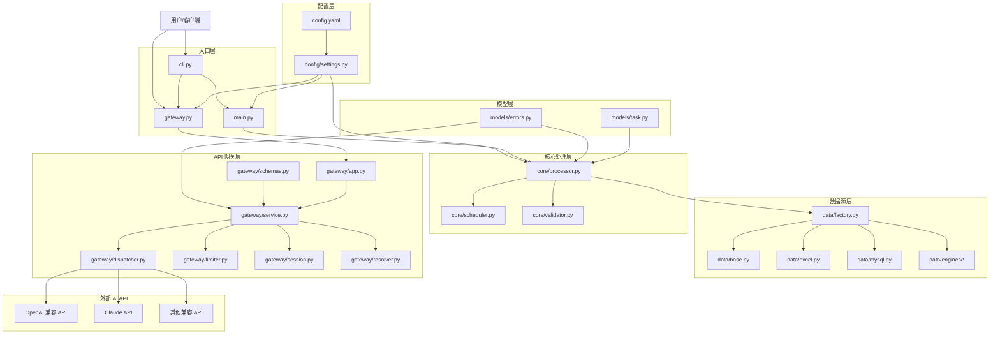

# 逻辑框架图

```mermaid
flowchart TB
  User[用户/客户端]

  subgraph Entry["入口层"]
    CLI[cli.py]
    Main[main.py]
    Gateway[gateway.py]
  end

  subgraph Config["配置层"]
    ConfigFile[config.yaml]
    Settings[config/settings.py]
  end

  subgraph Models["模型层"]
    Errors[models/errors.py]
    TaskMeta[models/task.py]
  end

  subgraph Core["核心处理层"]
    Processor[core/processor.py]
    Scheduler[core/scheduler.py]
    Validator[core/validator.py]
  end

  subgraph Data["数据源层"]
    Factory[data/factory.py]
    BasePool[data/base.py]
    Excel[data/excel.py]
    MySQL[data/mysql.py]
    Engines[data/engines/*]
  end

  subgraph GatewayLayer["API 网关层"]
    App[gateway/app.py]
    Service[gateway/service.py]
    Dispatcher[gateway/dispatcher.py]
    Limiter[gateway/limiter.py]
    Session[gateway/session.py]
    Resolver[gateway/resolver.py]
    Schemas[gateway/schemas.py]
  end

  subgraph External["外部 AI API"]
    OpenAI[OpenAI 兼容 API]
    Claude[Claude API]
    Other[其他兼容 API]
  end

  User --> CLI
  User --> Gateway
  CLI --> Main
  CLI --> Gateway

  ConfigFile --> Settings
  Settings --> Main
  Settings --> Gateway
  Settings --> Processor

  Main --> Processor
  Processor --> Scheduler
  Processor --> Validator
  Processor --> Factory

  Factory --> BasePool
  Factory --> Excel
  Factory --> MySQL
  Factory --> Engines

  Errors --> Processor
  TaskMeta --> Processor
  Errors --> Service
  Schemas --> Service

  Gateway --> App
  App --> Service
  Service --> Dispatcher
  Service --> Limiter
  Service --> Session
  Service --> Resolver

  Dispatcher --> OpenAI
  Dispatcher --> Claude
  Dispatcher --> Other
```
