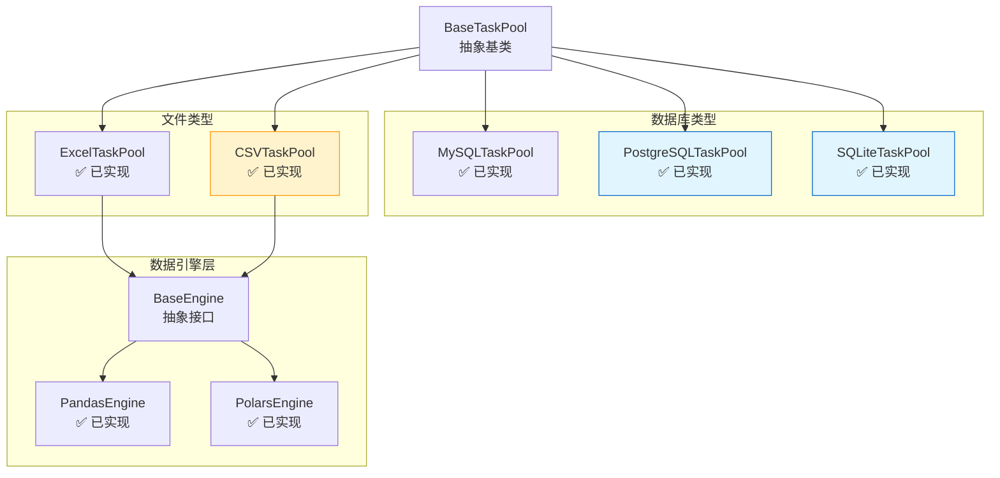

# AI-DataFlux 架构图

## 整体架构

```
┌─────────────────────────────────────────────────────────────────────────────┐
│                         AI-DataFlux 批处理引擎                                │
├─────────────────────────────────────────────────────────────────────────────┤
│                                                                             │
│  ┌──────────────┐        ┌──────────────────┐        ┌─────────────────┐  │
│  │   CLI 入口    │        │  配置管理层       │        │   日志系统       │  │
│  │  (cli.py)    │───────▶│ (settings.py)    │◀───────│  (logging)      │  │
│  └──────┬───────┘        └──────────────────┘        └─────────────────┘  │
│         │                                                                  │
│         ▼                                                                  │
│  ┌──────────────────────────────────────────────────────────────────────┐ │
│  │                       核心处理引擎                                     │ │
│  │                 (UniversalAIProcessor)                                │ │
│  │                                                                        │ │
│  │  • 状态管理 (TaskStateManager)         • API 通信 (FluxAIClient)      │ │
│  │  • 内容处理 (ContentProcessor)         • 策略决策 (RetryStrategy)     │ │
│  │  • 分片管理 (ShardedTaskManager)       • 验证器 (JsonValidator)       │ │
│  └─────────────────────────────┬──────────────────────────────────────────┘ │
│                                │                                           │
│                                ▼                                           │
│         ┌──────────────────────────────────────────────┐                  │
│         │          数据源抽象层 (BaseTaskPool)          │                  │
│         │                                               │                  │
│         │  接口定义:                                    │                  │
│         │  • get_total_task_count()                    │                  │
│         │  • initialize_shard()                        │                  │
│         │  • get_task_batch()                          │                  │
│         │  • update_task_results()                     │                  │
│         │  • reload_task_data()                        │                  │
│         └──────────────────┬───────────────────────────┘                  │
│                            │                                               │
│         ┌──────────────────┴───────────────────────┐                      │
│         │                                           │                      │
│         ▼                                           ▼                      │
│  ┌─────────────────┐                      ┌─────────────────┐             │
│  │  数据库类型数据源 │                      │  文件类型数据源  │             │
│  │                 │                      │                 │             │
│  │ ┌─────────────┐ │                      │ ┌─────────────┐ │             │
│  │ │MySQLTaskPool│ │                      │ │ExcelTaskPool│ │             │
│  │ └─────────────┘ │                      │ └──────┬──────┘ │             │
│  │ ┌─────────────┐ │                      │        │        │             │
│  │ │PostgreSQL   │ │                      │        ▼        │             │
│  │ │  TaskPool   │ │                      │ ┌──────────────┐│             │
│  │ └─────────────┘ │                      │ │ BaseEngine   ││             │
│  │ ┌─────────────┐ │                      │ │  抽象层      ││             │
│  │ │SQLiteTask   │ │                      │ └──────┬───────┘│             │
│  │ │   Pool      │ │                      │        │        │             │
│  │ └─────────────┘ │                      │   ┌────┴────┐   │             │
│  │                 │                      │   │         │   │             │
│  │  直接使用驱动:  │                      │   ▼         ▼   │             │
│  │  • mysql.connector                     │ Pandas  Polars  │             │
│  │  • psycopg2    │                      │ Engine  Engine  │             │
│  │  • sqlite3     │                      │                 │             │
│  └─────────────────┘                      └─────────────────┘             │
│                                                                             │
│                           ┌───────────────────┐                            │
│                           │   工厂模式         │                            │
│                           │ (create_task_pool) │                            │
│                           └───────────────────┘                            │
│                                                                             │
│                                   │                                         │
│                                   ▼                                         │
│                           ┌───────────────────┐                            │
│                           │   API Gateway     │                            │
│                           │  (FastAPI)        │                            │
│                           │                   │                            │
│                           │  • ModelDispatcher│                            │
│                           │  • TokenBucket    │                            │
│                           │  • SessionPool    │                            │
│                           └───────────────────┘                            │
│                                   │                                         │
│                                   ▼                                         │
│                           ┌───────────────────┐                            │
│                           │   AI Models       │                            │
│                           │  (OpenAI API)     │                            │
│                           └───────────────────┘                            │
└─────────────────────────────────────────────────────────────────────────────┘
```

---

## 数据源层详细架构

### 现有数据源 + 新增数据源



---

## 数据流架构

```
┌─────────────────────────────────────────────────────────────────────────┐
│                           数据处理流程                                    │
└─────────────────────────────────────────────────────────────────────────┘

1. 配置加载
   ┌──────────────┐
   │ config.yaml  │
   └──────┬───────┘
          │
          ▼
   ┌──────────────┐      ┌─────────────────────────────────────┐
   │ load_config()│─────▶│ 深度合并 DEFAULT_CONFIG              │
   └──────┬───────┘      └─────────────────────────────────────┘
          │
          ▼
   datasource.type = ?
          │
          ├─── mysql ────────┐
          ├─── postgresql ───┤
          ├─── sqlite ───────┼────▶ create_task_pool()
          ├─── excel ────────┤         (工厂方法)
          └─── csv ──────────┘
                 │
                 ▼
          ┌──────────────┐
          │  TaskPool    │
          │   实例       │
          └──────┬───────┘
                 │
   2. 任务统计与分片
                 │
                 ▼
          ┌──────────────────────────┐
          │ get_total_task_count()   │──▶ 未处理任务数
          │ get_id_boundaries()      │──▶ (min_id, max_id)
          └──────┬───────────────────┘
                 │
                 ▼
          ┌──────────────────────────┐
          │ ShardedTaskManager       │
          │  • 动态分片计算           │
          │  • 自适应调整分片大小     │
          │  • 内存监控              │
          └──────┬───────────────────┘
                 │
   3. 分片处理循环 (Continuous)
                 │
        ┌────────┴────────┐
        │                 │
        ▼                 ▼
   ┌─────────┐      ┌─────────┐
   │ Shard 1 │  ... │ Shard N │
   └────┬────┘      └────┬────┘
        │                │
        │  initialize_shard(shard_id, min_id, max_id)
        │                │
        ▼                ▼
   ┌──────────────────────────┐
   │  内存任务队列             │
   │  [(id, data), ...]       │
   └──────┬───────────────────┘
          │
   4. 批量处理与组件编排
          │
          ▼
   ┌──────────────────────────┐
   │ TaskStateManager         │
   │  • try_start_task()      │──▶ 状态追踪与防重
   └──────┬───────────────────┘
          │
          ▼
   ┌──────────────────────────┐
   │ ContentProcessor         │
   │  • create_prompt()       │──▶ 模板渲染
   └──────┬───────────────────┘
          │
          ▼
   ┌──────────────────────────┐
   │ FluxAIClient             │
   │  • call(session, msgs)   │──▶ 异步 API 调用
   └──────┬───────────────────┘
          │
          ▼
   ┌──────────────────────────┐
   │  API Gateway             │
   │  • 模型选择（加权随机）   │
   │  • 速率限制（令牌桶）     │
   │  • 自动重试（退避策略）   │
   └──────┬───────────────────┘
          │
          ▼
   ┌──────────────────────────┐
   │  AI Models               │
   │  (OpenAI-compatible API) │
   └──────┬───────────────────┘
          │
   5. 结果处理与写回
          │
          ▼
   ┌──────────────────────────┐
   │ ContentProcessor         │
   │  • parse_response()      │──▶ JSON 提取与验证
   └──────┬───────────────────┘
          │
          ├─── 成功 ────┐
          │             ▼
          │     ┌────────────────┐
          │     │ update_task_   │
          │     │  results()     │──▶ 批量写回数据源
          │     └────────────────┘
          │
          └─── 失败 ────┐
                        ▼
                ┌───────────────────────┐
                │ RetryStrategy         │
                │  • decide(error_type) │
                │  • API Error: Reload  │
                │  • Content Error: Retry│
                └───────────────────────┘
                        │
                        ▼
                ┌───────────────────────┐
                │ reload_task_data()    │──▶ 从数据源重新加载
                │ add_task_to_front()   │──▶ 放回队列头部
                └───────────────────────┘

   6. 分片完成，循环至下一分片
          │
          ▼
   [ 重复步骤 3-5 直到所有分片完成 ]
          │
          ▼
   ┌──────────────────────────┐
   │  close()                 │──▶ 最终保存 + 资源清理
   └──────────────────────────┘
```

---

## 引擎选择流程（文件类型）

```
┌─────────────────────────────────────────┐
│  配置: datasource.engine = ?            │
└─────────────────┬───────────────────────┘
                  │
        ┌─────────┼─────────┐
        │         │         │
        ▼         ▼         ▼
     "auto"   "pandas"  "polars"
        │         │         │
        │         ▼         ▼
        │    PandasEngine PolarsEngine
        │         │         │
        │         └────┬────┘
        │              │
        ▼              │
   ┌─────────┐        │
   │ Polars  │        │
   │ 可用?   │        │
   └────┬────┘        │
        │             │
   ┌────┴─────┐       │
   │          │       │
   YES        NO      │
   │          │       │
   ▼          ▼       │
Polars    Pandas     │
Engine    Engine     │
   │          │       │
   └──────────┴───────┘
              │
              ▼
   ┌──────────────────┐
   │  选择读写器       │
   │  • excel_reader: │
   │    calamine/     │
   │    openpyxl      │
   │  • excel_writer: │
   │    xlsxwriter/   │
   │    openpyxl      │
   └──────────────────┘
```

---

## 错误处理架构

```
┌────────────────────────────────────────────────────────────┐
│                    错误分类系统                             │
└────────────────────────────────────────────────────────────┘

AI 请求失败
    │
    ▼
┌───────────────────┐
│  错误分类器        │
│ (classify_error)  │
└─────┬─────────────┘
      │
      ├─── APIError ────────────┐
      │    • HTTP 错误          │
      │    • 超时               │
      │    • 连接失败           │
      │                         │
      ├─── ContentError ────────┤
      │    • JSON 解析失败      │
      │    • 字段缺失           │
      │    • 验证失败           │
      │                         │
      └─── SystemError ─────────┘
           • 内部异常
           • 未知错误
                │
                ▼
        ┌───────────────────┐
        │   RetryStrategy    │
        │ (策略决策引擎)      │
        └───────────────────┘
                │
    ┌───────────┼───────────┐
    │           │           │
    ▼           ▼           ▼
APIError    ContentError  SystemError
    │           │           │
    ▼           ▼           ▼
┌────────┐  ┌────────┐  ┌────────┐
│全局暂停│  │直接重试│  │直接重试│
│reload  │  │无暂停  │  │无暂停  │
│数据    │  │        │  │        │
└────┬───┘  └───┬────┘  └───┬────┘
     │          │           │
     │          │           │
     └──────────┴───────────┘
                │
                ▼
        retry_count++
                │
                ▼
        ┌───────────────┐
        │ 达到重试上限? │
        └───┬───────────┘
            │
        ┌───┴───┐
        │       │
       YES      NO
        │       │
        ▼       ▼
    标记失败  继续重试
    写回错误  放回队列
```

---

## 性能优化架构

### 向量化过滤（文件类型）

```
传统逐行遍历 (慢)               向量化过滤 (快 50-100 倍)
┌──────────────┐               ┌──────────────────────┐
│ for row in   │               │ DataFrame.apply()    │
│   dataframe: │               │   vectorized         │
│   if check() │               │   operations         │
│     ...      │               │                      │
└──────────────┘               └──────────────────────┘
      │                                 │
      ▼                                 ▼
  100,000 行                        100,000 行
  耗时: 10s                         耗时: 0.1s

实现示例:
┌────────────────────────────────────────────────┐
│ engine.filter_indices_vectorized(              │
│     df,                                        │
│     input_columns,   # 输入列必须非空           │
│     output_columns,  # 输出列任一为空           │
│     require_all_input_fields=True              │
│ )                                              │
│                                                │
│ 返回: [idx1, idx2, ...] 未处理的索引列表       │
└────────────────────────────────────────────────┘
```

### 内存管理

```
┌────────────────────────────────────────────────┐
│          内存监控与优化                         │
└────────────────────────────────────────────────┘

1. 分片大小动态调整
   ┌─────────────────┐
   │ 内存使用率       │
   │  < 60%          │──▶ 增加分片大小
   │  60-85%         │──▶ 保持当前大小
   │  > 85%          │──▶ 减少分片大小 + 触发 GC
   └─────────────────┘

2. 任务元数据分离 (TaskStateManager)
   ┌─────────────────┐      ┌─────────────────┐
   │  业务数据        │      │  任务元数据      │
   │  (存储在数据源)  │  ←分离→ │  (内存缓存)     │
   │                 │      │  • retry_count  │
   │                 │      │  • error_history│
   └─────────────────┘      └─────────────────┘
                                    │
                                    ▼
                            定期清理（24小时）
                            避免内存泄漏

3. GC 策略
   - 内存 > 85% 或进程 > 40GB → 触发 gc.collect()
   - 清理元数据缓存
   - 记录清理效果
```

---

## 并发模型

```
┌────────────────────────────────────────────────────┐
│            连续任务流模型                           │
│      (Continuous Task Flow Pattern)                │
└────────────────────────────────────────────────────┘

传统批处理模型 (Batch-and-Wait):
┌─────────┐     ┌─────────┐     ┌─────────┐
│ Batch 1 │ ──▶ │ Wait    │ ──▶ │ Batch 2 │
│ 100 任务 │     │ All Done│     │ 100 任务 │
└─────────┘     └─────────┘     └─────────┘
    ▲                                 │
    └─────────── 重试任务 ─────────────┘

问题:
• 等待最慢任务完成才开始下一批
• 并发度下降（失败任务无法立即补充）
• 内存占用高（批次结果堆积）


连续任务流模型 (Continuous Flow):
┌─────────────────────────────────────────┐
│         任务池（动态填充）               │
│  [Task1] [Task2] ... [Task100]         │
│     ▲                      │            │
│     │                      ▼            │
│  补充新任务           完成/失败          │
│     │                      │            │
│     └──────────────────────┘            │
│                                         │
│  始终保持 max_concurrency 个任务在飞    │
└─────────────────────────────────────────┘

优势:
• ✅ 实时补充任务，并发度恒定
• ✅ 失败任务立即重试
• ✅ 内存占用低（流式处理）
• ✅ 灵活的错误处理

实现: process_shard_async_continuous()
```

---

## 新数据源集成点

```
┌────────────────────────────────────────────────┐
│  添加新数据源需要修改的文件                     │
└────────────────────────────────────────────────┘

1. src/data/新数据源.py
   └── 实现 BaseTaskPool 的所有抽象方法

2. src/data/factory.py
   ├── 添加可用性检查（如需额外依赖）
   ├── 实现 _create_xxx_pool() 工厂方法
   └── 在 create_task_pool() 添加分支

3. config.yaml（用户配置）
   └── 添加数据源配置节

4. tests/test_xxx_pool.py
   └── 单元测试 + 集成测试

5. docs/（可选）
   └── 实现指南文档
```

---

## 配置驱动架构

```
┌────────────────────────────────────────────────┐
│           配置层次结构                          │
└────────────────────────────────────────────────┘

DEFAULT_CONFIG (内置)
        │
        ▼
   load_config(config.yaml)
        │
        ▼
   merge_config()  ◀───── 深度合并
        │
        ▼
   最终配置字典
        │
        ├─── global
        │     ├── log
        │     └── flux_api_url
        │
        ├─── datasource
        │     ├── type  ──────────┐
        │     ├── engine           │
        │     └── concurrency      │
        │                          │
        ├─── mysql                 │
        ├─── postgresql            ├── 动态选择
        ├─── sqlite                │
        ├─── excel                 │
        └─── csv  ─────────────────┘
              │
              ▼
      create_task_pool()
```

---

**架构设计特点总结**:

1. **高内聚低耦合** - 组件化设计（Content, State, Retry, Clients），职责清晰
2. **策略模式** - BaseEngine 支持多引擎切换，RetryStrategy 支持灵活重试
3. **工厂模式** - 统一创建接口，配置驱动数据源实例化
4. **模板方法** - BaseTaskPool 定义流程骨架
5. **依赖注入** - 组件通过构造函数注入到 Processor
6. **异步并发** - aiohttp + asyncio 高性能 I/O
7. **流式处理** - 连续任务流模型，内存友好
8. **分层架构** - 数据源层 → 引擎层 → 处理层 → 网关层

---

**文档版本**: v2.0
**最后更新**: 2026-01-23
